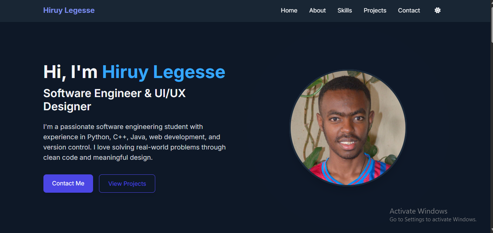

# hiruy-legesse-portfolio

A modern, responsive portfolio website showcasing my skills, projects, and experience as a Software Engineering student.

Features ✨

- Modern UI Design: Clean, professional interface with dark/light mode
- Responsive Layout: Works perfectly on all devices
- Interactive Elements:
  - Animated navigation
  - Interactive project cards
  - Smooth scrolling
- Contact Form**: Integrated with Web3Forms for easy communication
- Performance Optimized: Fast loading times

 Technologies Used 🛠️

- Frontend:
  - HTML5
  - Tailwind CSS
  - JavaScript (ES6+)
- Tools:
  - Web3Forms (for contact form)
  - Font Awesome (icons)
  - Google Fonts (Inter font family)

 Sections 📋

1. Home: Hero section with introduction
2. About: Personal information and background
3. Skills: Technical skills with icons
4. Projects: Showcase of work with interactive cards
5. Certificates: Showcase of certificates
6. Contact: Contact form with multiple contact methods
